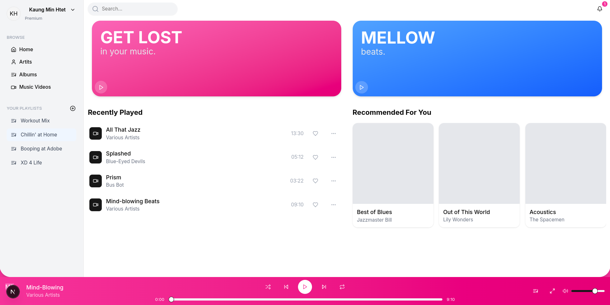
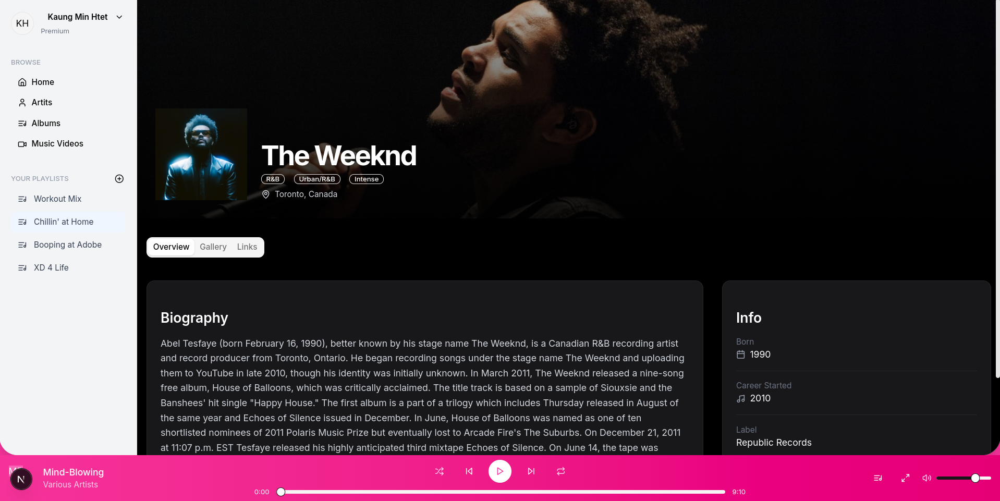
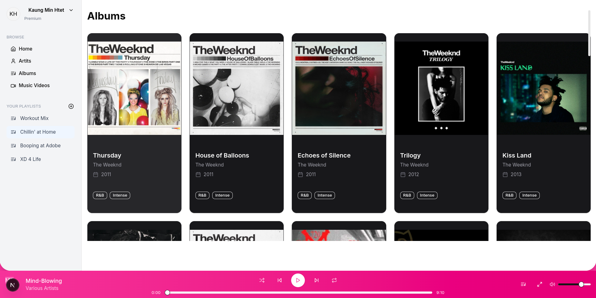
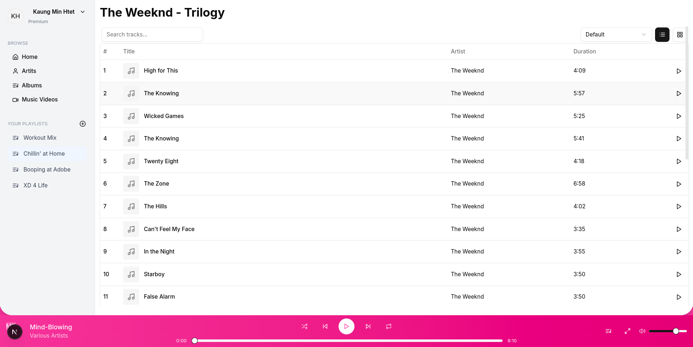
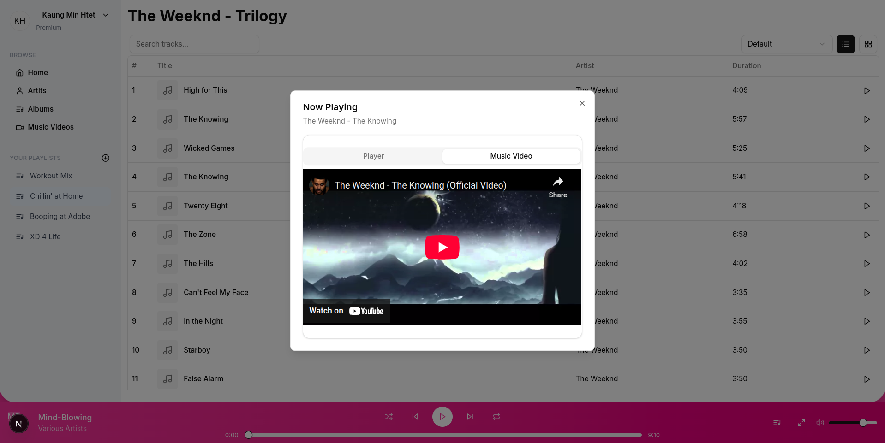

# Music App

A modern music browsing application built with Next.js and Shadcn UI components. Explore artists, albums, tracks, and music videos with a beautiful, responsive interface.


## Features

- Browse artists, albums, and tracks
- View detailed artist information
- Play music videos with integrated YouTube player

## How to run the application

```bash
# Clone the repository
git clone https://github.com/kaungminhtet-swe/visible_one_test

# Navigate to project directory
cd music_app

# Install dependencies
pnpm install

# Start the development server
pnpm run dev
```

Then open [http://localhost:3000](http://localhost:3000) in your browser.

## Screenshots

### Home Page



### Artist Page



### Album Page



### Music Videos



### Playing Music Video



## Technologies Used

- Next.js 14 (App Router)
- TypeScript
- Tailwind CSS
- Shadcn UI Components
- Lucide React Icons

## License

MIT
